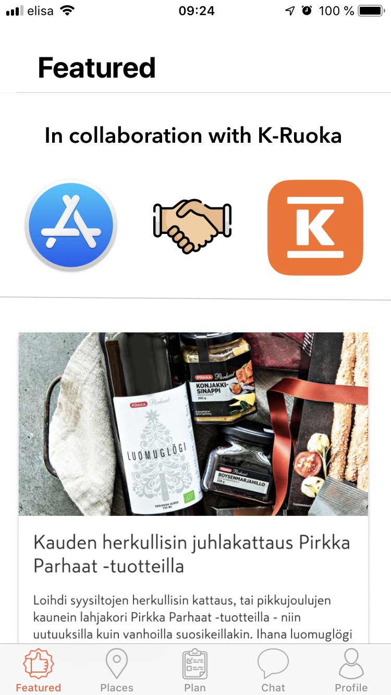

# JUNCTIONxKESKO challenge
### Project name: K-Fit
#### Punchline: Personal assistant with smart plans powered by AI

### Description: 

We are glad to present our app K-Fit, that brings user experience in digital retail to a new level. In collaboration with K-Market we came up with the ideas how to make everyday shopping more healthy, sustainable and convenient.
For better personalization we are providing a way to log in with existing loyalty card. 

This also lets us save your receipts for better recommendations.
The front page demonstrates the most interesting promos and discounts in nearby stores. Next you can see a beautiful map with local shops along with their working hours.
Health is priceless. We created a unique concept of a Smart Plan for you to change your eating habits. Using personalized information about your allergies and other nutrition preferences we provide a guideline for you to buy specific products in K-Market to have a healthier lifestyle. For people following various eating ideologies we present a large variety of personalized Smart Plans.
Now we are presenting something huge. There is a large gap in communications between a customer and a retailer. In particular, most customer issues may be resolved without any retailer interference. In our App we present an innovative Personal Assistant powered by AI that automatically answers most users queries.

Where is the nearest shop?
Where can you get the product in some local store?
Is something healthy?
What can I cook from …?

For example, you no longer have to leave home to find out the availability of your favourite products at your nearest shop. Or you can find out some interesting information about healthiness of a particular product. 
We believe that further integration with K-Market services will bring ease and happiness for our customers.

